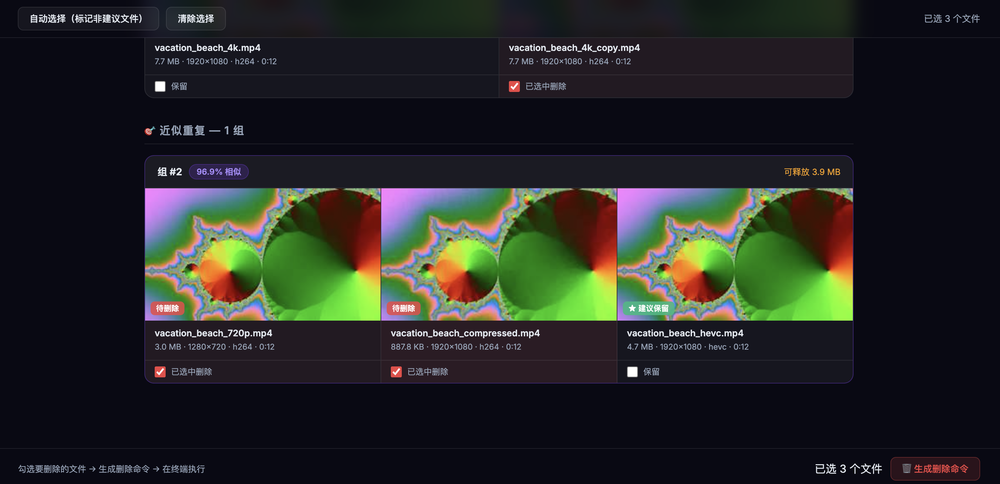

# VidDup 🎬

**A fast, local video duplicate detector — finds re-encoded, re-scaled, and compressed copies that other tools miss.**

[](https://github.com/Pengfei-Kou/viddup/actions)
[](https://pypi.org/project/viddup/)
[](https://pypi.org/project/viddup/)
[](LICENSE)

---

## Demo


> 扫描完成后自动生成交互式 HTML 报告 ↓




---

## Why VidDup?

Most duplicate detectors only find **byte-for-byte identical** files. VidDup goes further:

| Scenario | dupeGuru | Czkawka | **VidDup** |
|----------|:--------:|:-------:|:----------:|
| Exact copy (same file) | ✅ | ✅ | ✅ |
| Re-encoded (H.264 → HEVC) | ❌ | ❌ | ✅ |
| Re-scaled (1080p → 720p) | ❌ | ❌ | ✅ |
| Compressed (high → low bitrate) | ❌ | ❌ | ✅ |
| Incremental cache (skip unchanged files) | ❌ | ❌ | ✅ |
| Interactive HTML report with thumbnails | ❌ | ❌ | ✅ |

VidDup uses **perceptual frame hashing (pHash)** across multiple sampled frames per video, with a low-variance frame filter to ignore black/fade frames that cause false positives.

---

## Quick Start

```bash
# Install VidDup (FFmpeg is bundled automatically — no extra steps!)
pip install viddup

# Scan a directory
viddup scan ~/Movies
```

That's it. A terminal report is printed and an **interactive HTML report** (with video thumbnails) is automatically saved to the scanned directory and opened in your browser.

> 💡 **Zero external dependencies** — VidDup bundles a static FFmpeg binary via `imageio-ffmpeg`. No need to `brew install ffmpeg` or `apt install ffmpeg`.

---

## Features

- **Three-layer detection**
  - L1: xxHash3-128 — instant exact-copy detection
  - L2: Duration metadata — groups candidates, skips impossible pairs
  - L3: 10-frame pHash — perceptual similarity across re-encodes and re-scales
- **Robust pHash comparison** — uses median Hamming distance (not average), resistant to black frames, fade-outs, and title cards
- **Smart frame selection** — automatically skips solid-color frames and retries with alternate timestamps
- **Ultra-short video handling** — graceful degradation for clips under 3 seconds
- **Incremental SQLite cache** — fingerprints are cached; re-scanning a library of 500 videos takes seconds after the first run
- **Multi-directory scan** — finds duplicates across multiple folders in one pass
- **`.viddup_ignore`** — exclude directories and files with glob patterns, like `.gitignore`
- **Hardware acceleration** — automatically uses VideoToolbox on macOS (Apple Silicon & Intel)
- **Interactive HTML report** — embedded thumbnails, one-click delete-script generation, copy to clipboard

---

## Installation

### Requirements

- Python 3.11+
- FFmpeg — **bundled automatically** (or use your own system install)

```bash
# Recommended: one command, everything included
pip install viddup

# Or run directly without installing (via uvx)
uvx viddup scan ~/Movies

# From source (development)
git clone https://github.com/Pengfei-Kou/viddup.git
cd viddup
python -m venv .venv && source .venv/bin/activate
pip install -e ".[dev]"
```

> 🔧 **Already have FFmpeg installed?** VidDup will automatically prefer your system `ffmpeg` over the bundled one. No configuration needed.

---

## Supported Video Formats

VidDup scans files with the following extensions:

| Format | Extension |
|--------|-----------|
| MPEG-4 | `.mp4`, `.m4v` |
| Matroska | `.mkv` |
| AVI | `.avi` |
| QuickTime | `.mov` |
| WebM | `.webm` |
| Flash Video | `.flv` |
| Windows Media | `.wmv` |
| MPEG Transport Stream | `.ts` |
| MPEG | `.mpeg`, `.mpg` |
| 3GPP | `.3gp` |

Other formats can be decoded if FFmpeg supports them — contributions to extend the list are welcome!

---

## Usage

### `viddup scan` — find duplicates

```bash
# Basic scan
viddup scan ~/Movies

# Scan multiple directories (finds cross-folder duplicates)
viddup scan ~/Movies ~/Downloads/Videos

# Stricter threshold (only report very similar videos)
viddup scan ~/Movies --threshold 0.92

# Looser duration filter (catches clips with trimmed intros)
viddup scan ~/Movies --duration-tol 0.15

# Preview what would be scanned (no DB writes)
viddup scan ~/Movies --dry-run

# Save report to a specific directory
viddup scan ~/Movies --output ~/Desktop

# Don't auto-open the browser
viddup scan ~/Movies --no-open

# Force re-fingerprint everything (ignore cache)
viddup scan ~/Movies --no-cache
```

**Full options:**

```
Options:
  -t, --threshold FLOAT         Similarity threshold (0–1). Default: 0.85
  -f, --frames INTEGER          Frames sampled per video. Default: 10
  --duration-tol FLOAT          Duration tolerance for pre-filter. Default: 0.05 (±5%)
  --db PATH                     Fingerprint database path. Default: ~/.viddup/fingerprints.db
  -w, --workers INTEGER         Parallel worker processes. Default: CPU count
  -o, --output PATH             Report output directory. Default: first scanned directory
  --no-cache                    Ignore cache, recompute all fingerprints
  --recursive / --no-recursive  Recurse into subdirectories. Default: on
  --dry-run                     List files to be processed without writing DB
  --html / --no-html            Generate interactive HTML report. Default: on
  --open / --no-open            Auto-open HTML report in browser. Default: on
  -v, --verbose                 Show per-file progress
```

### `viddup status` — cache info

```bash
viddup status
# Shows: cached video count, orphan records, database size, last scan time
```

### `viddup clear` — clean up cache

```bash
# Remove records whose files no longer exist
viddup clear --orphans-only

# Wipe the entire cache
viddup clear --confirm
```

---

## `.viddup_ignore`

Place a `.viddup_ignore` file in any scan directory to exclude files or subdirectories:

```gitignore
# Lines starting with # are comments

# Exclude directories (trailing slash required)
BRaw/
原始素材/
proxies/

# Exclude by filename glob
temp_*
*.tmp
._*

# Exclude by relative path glob
Backups/**
archive/2020/**
```

VidDup reports how many files were filtered when an ignore file is active.

---

## How It Works

```
Each video goes through three layers:

 ┌─────────────────────────────────────────────────┐
 │  L1 — File Hash (xxHash3-128)                    │
 │  Identical bytes → immediate match, skip L2/L3  │
 └──────────────────────────┬──────────────────────┘
                            │ not exact
 ┌──────────────────────────▼──────────────────────┐
 │  L2 — Metadata Pre-filter (ffprobe)              │
 │  Duration difference > 5% → skip pair            │
 │  Reduces O(n²) comparisons to small groups       │
 └──────────────────────────┬──────────────────────┘
                            │ duration match
 ┌──────────────────────────▼──────────────────────┐
 │  L3 — Perceptual Frame Hash (pHash)              │
 │  Sample 10 frames at 5%, 15%, ..., 95%           │
 │  Skip low-variance frames (black/solid color)    │
 │  Compute pHash per frame → compare sequences     │
 │  Median Hamming distance < threshold → duplicate │
 └─────────────────────────────────────────────────┘
```

**"Suggest keep" priority** (shown in HTML report):
1. Highest resolution (width × height)
2. Largest file size (less compression loss)
3. Alphabetical path (deterministic tiebreak)

---

## HTML Report

After scanning, VidDup generates a self-contained `viddup_report_*.html` file saved directly in the scanned directory. No server required — open it with any browser.

The report includes:
- **Video thumbnails** (extracted from the middle of each file, embedded as base64)
- **Grouped duplicate cards** sorted by reclaimable space
- **"Suggest keep" badge** for the recommended file in each group
- **Checkboxes** to select files for deletion (non-suggested files pre-selected)
- **Generate delete script** → shell commands you can review and execute in your terminal
- **Copy to clipboard** button

> ⚠️ VidDup never deletes files automatically. You always review the generated `rm` commands before executing them.

---

## Performance

Fingerprinting speed is limited by ffmpeg frame extraction (I/O + decode) and scales linearly with video count. The main bottleneck is the **first scan** of a new library — subsequent scans reuse the SQLite cache and complete in seconds regardless of library size.

**Tips for faster scans:**
- macOS: VideoToolbox hardware decoding is enabled automatically — no action needed.
- Reduce `--frames` (e.g. `--frames 6`) for a 40% speedup with minimal accuracy loss on long videos.
- Increase `--workers` on machines with many CPU cores.
- Use `--duration-tol` conservatively — a tighter window means fewer L3 comparisons.

---

## Configuration Reference

| Setting | Default | Notes |
|---------|---------|-------|
| `--threshold` | `0.85` | Lower = more matches (more false positives). Try `0.90`–`0.95` for stricter. |
| `--frames` | `10` | More frames = slower but more accurate. `6` is usually sufficient for short clips. |
| `--duration-tol` | `0.05` | Increase to `0.10`–`0.15` if you expect trimmed intros/outros. |
| `--workers` | CPU count | Reduce if your system slows down during scanning. |

---

## Limitations

- **No semantic understanding**: VidDup cannot detect if two videos are "about" the same topic but visually different (e.g., two different recordings of the same lecture).
- **Duration pre-filter**: Videos differing by more than `--duration-tol` will not be compared at L3, even if they are perceptually similar. Increase the tolerance if needed.
- **Corrupt files**: Videos that `ffprobe` cannot parse are skipped and reported in the terminal output.

---

## Contributing

Contributions are welcome! See [CONTRIBUTING.md](CONTRIBUTING.md) for guidelines.

```bash
git clone https://github.com/Pengfei-Kou/viddup.git
cd viddup
python -m venv .venv && source .venv/bin/activate
pip install -e ".[dev]"
pytest          # run tests
ruff check .    # lint
```

### Roadmap

- [ ] **v0.2**: Demo GIF and HTML report screenshots in README
- [ ] **v0.3**: BK-tree for large libraries (10,000+ videos), audio fingerprint verification, `.viddup_ignore` negation patterns
- [ ] **v0.4**: Standalone binaries via PyInstaller + GitHub Actions (macOS, Windows, Linux)
- [ ] **v1.0**: PyQt desktop GUI option, Windows full testing

---

## License

MIT © VidDup Contributors
